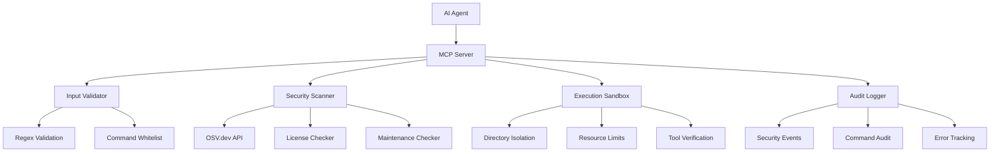
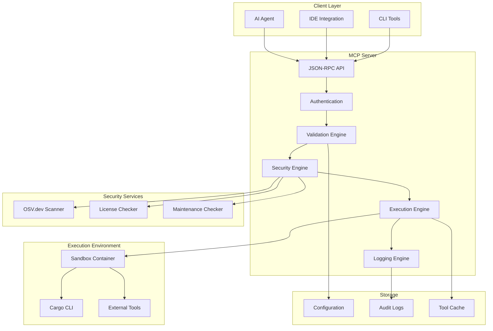

# CogPilot Overview and Architecture

## Table of Contents

- [Executive Summary](#executive-summary)
- [Target Use Cases](#target-use-cases)
- [Security Model Overview](#security-model-overview)
- [System Architecture](#system-architecture)
- [Threat Model Summary](#threat-model-summary)
- [Key Principles](#key-principles)
- [System Components](#system-components)
- [Data Flow](#data-flow)
- [Integration Points](#integration-points)

## Executive Summary

CogPilot is a secure Model Context Protocol (MCP) server that enables AI agents to safely interact with Rust Cargo commands and related development tools. The system prioritizes security through strict isolation, comprehensive validation, and defense-in-depth strategies.

### Core Value Proposition

- **Safe AI-Cargo Integration**: Enables AI agents to assist with Rust development without compromising security
- **Comprehensive Security**: Multi-layered protection against common attack vectors
- **Tool Ecosystem Support**: Integrates with popular Rust development tools
- **Production Ready**: Designed for enterprise deployment with comprehensive monitoring

### Key Capabilities

- Execute Cargo commands in isolated environments
- Perform real-time dependency security scanning
- Validate all inputs against strict security criteria
- Integrate with external tools while maintaining security boundaries
- Provide comprehensive audit logging and monitoring

## Target Use Cases

### AI-Assisted Development

- **Code Generation**: AI agents can create new Rust projects and add dependencies safely
- **Dependency Management**: Intelligent dependency updates with security validation
- **Code Quality**: Automated formatting, linting, and testing integration
- **Security Auditing**: Continuous security scanning during development

### CI/CD Integration

- **Pipeline Security**: Secure execution of Cargo commands in CI environments
- **Automated Testing**: Integration with testing frameworks and coverage tools
- **Security Gates**: Automated security validation before deployments
- **Compliance Reporting**: Comprehensive audit trails for compliance requirements

### Development Environment Management

- **Project Initialization**: Secure project setup with validated dependencies
- **Tool Integration**: Safe integration with development tools
- **Environment Isolation**: Protection of host systems from malicious code
- **Resource Management**: Controlled resource usage for development tasks

## Security Model Overview

### Security Architecture

### Security Layers

1. **Input Validation**: Strict validation of all inputs using regex patterns
2. **Command Authorization**: Whitelist-based command execution
3. **Dependency Scanning**: Real-time CVE and security scanning
4. **Sandbox Execution**: Isolated execution environment
5. **Resource Control**: CPU, memory, and I/O limits
6. **Audit Logging**: Comprehensive security event logging

## System Architecture

### High-Level Architecture

### Component Architecture

#### MCP Server Core

- **JSON-RPC Handler**: Processes MCP protocol messages
- **Authentication Module**: Validates client credentials
- **Validation Engine**: Enforces input validation rules
- **Security Engine**: Performs security checks and scanning
- **Execution Engine**: Manages command execution
- **Logging Engine**: Handles audit and security logging

#### Security Services

- **OSV.dev Integration**: CVE vulnerability scanning
- **License Compatibility**: License validation and compatibility checking
- **Maintenance Verification**: Package maintenance status verification
- **Dependency Analysis**: Comprehensive dependency security analysis

#### Execution Environment

- **Sandbox Container**: Isolated execution environment
- **Tool Verification**: External tool availability and version checking
- **Resource Management**: CPU, memory, and I/O control
- **Directory Isolation**: Working directory access control

## Threat Model Summary

### Primary Threats

1. **Malicious Dependency Injection**
   - Risk: High
   - Impact: Code execution, supply chain attacks
   - Mitigation: CVE scanning, license checking, maintenance verification

2. **Directory Traversal Attacks**
   - Risk: High
   - Impact: System file access, privilege escalation
   - Mitigation: Strict path validation, sandbox isolation

3. **Resource Exhaustion**
   - Risk: Medium
   - Impact: Denial of service, system instability
   - Mitigation: Resource limits, timeout controls

4. **Command Injection**
   - Risk: High
   - Impact: Arbitrary code execution
   - Mitigation: Input validation, command whitelisting

5. **Information Disclosure**
   - Risk: Medium
   - Impact: Sensitive data exposure
   - Mitigation: Output filtering, logging controls

### Attack Vectors

- **Malicious AI Agents**: Compromised or malicious AI systems
- **Supply Chain Attacks**: Compromised dependencies or tools
- **Configuration Attacks**: Malicious configuration files
- **Network Attacks**: Man-in-the-middle, DNS poisoning
- **Privilege Escalation**: Exploiting system vulnerabilities

## Key Principles

### Security First

All system components prioritize security over functionality. No feature is implemented without appropriate security controls.

### Least Privilege

Components and operations execute with the minimum privileges required for their function.

### Defense in Depth

Multiple layers of security controls protect against various attack vectors.

### Fail Secure

System failures default to secure states, denying access rather than allowing potentially dangerous operations.

### Transparency

All security decisions and actions are logged and auditable.

### Immutable Infrastructure

Core system components are immutable and cannot be modified during runtime.

## System Components

### Core Components

| Component | Purpose | Security Level |
|-----------|---------|----------------|
| MCP Server | Main server process | Critical |
| Validation Engine | Input validation | Critical |
| Security Engine | Security scanning | Critical |
| Execution Engine | Command execution | High |
| Logging Engine | Audit logging | High |

### External Dependencies

| Dependency | Purpose | Security Validation |
|------------|---------|-------------------|
| OSV.dev API | CVE scanning | API key validation |
| Cargo CLI | Rust package manager | Version verification |
| External Tools | Development tools | Availability checking |

### Configuration Components

| Component | Purpose | Validation |
|-----------|---------|------------|
| Security Config | Security policies | Schema validation |
| Tool Config | Tool configurations | Whitelist validation |
| Logging Config | Audit settings | Format validation |

## Data Flow

### Request Processing Flow

1. **Request Reception**: MCP server receives JSON-RPC request
2. **Authentication**: Client credentials validated
3. **Input Validation**: Request parameters validated against schemas
4. **Security Scanning**: Dependencies scanned for vulnerabilities
5. **Command Authorization**: Command checked against whitelist
6. **Sandbox Preparation**: Execution environment prepared
7. **Command Execution**: Command executed in isolated environment
8. **Output Processing**: Results filtered and validated
9. **Response Generation**: JSON-RPC response generated
10. **Audit Logging**: All actions logged for security review

### Security Validation Flow

1. **Input Parsing**: Extract and parse all input parameters
2. **Regex Validation**: Apply regex patterns to validate formats
3. **Whitelist Checking**: Verify commands against allowed operations
4. **Dependency Scanning**: Scan dependencies for security issues
5. **Resource Validation**: Check resource requirements against limits
6. **Path Validation**: Ensure all paths are within working directory
7. **Tool Verification**: Verify external tool availability
8. **Permission Checking**: Validate operation permissions
9. **Final Authorization**: Make go/no-go decision

## Integration Points

### MCP Protocol Integration

- **JSON-RPC 2.0**: Standard MCP protocol implementation
- **Tool Discovery**: Dynamic tool capability advertisement
- **Error Handling**: Comprehensive error reporting
- **Streaming Support**: Large output streaming capabilities

### External Tool Integration

- **Tool Verification**: Runtime tool availability checking
- **Version Compatibility**: Tool version validation
- **Configuration Management**: Tool-specific configuration handling
- **Error Propagation**: Tool error handling and reporting

### Security Service Integration

- **OSV.dev API**: Real-time vulnerability scanning
- **License Databases**: License compatibility checking
- **Maintenance APIs**: Package maintenance verification
- **Audit Systems**: External audit log integration

### Monitoring Integration

- **Metrics Collection**: Performance and security metrics
- **Log Aggregation**: Centralized logging systems
- **Alert Generation**: Security incident alerting
- **Health Monitoring**: System health and availability monitoring

## Conclusion

CogPilot's architecture provides a secure, scalable foundation for AI-assisted Rust development. The multi-layered security approach, combined with comprehensive validation and monitoring, ensures that AI agents can safely interact with Rust development tools while maintaining system integrity and security.

The architecture is designed to be extensible, allowing for future enhancements while maintaining backward compatibility and security guarantees.
