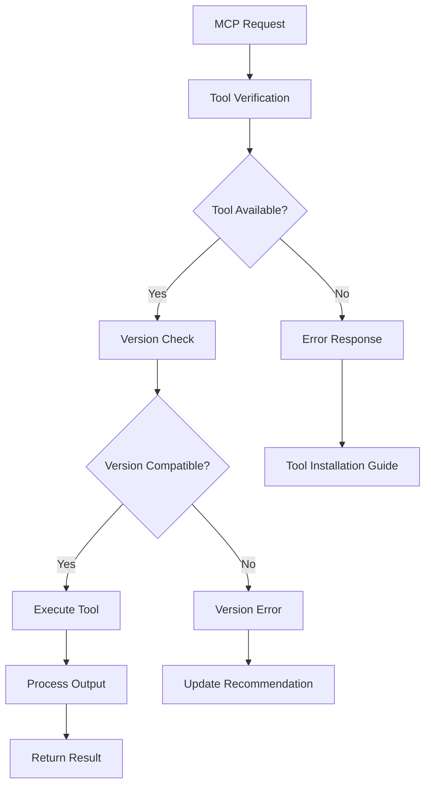

# External Tools Integration

## Table of Contents

- [Overview](#overview)
- [Tool Availability Checking](#tool-availability-checking)
- [Version Compatibility Requirements](#version-compatibility-requirements)
- [Installation Verification](#installation-verification)
- [Error Handling for Missing Tools](#error-handling-for-missing-tools)
- [No Automatic Installation Policy](#no-automatic-installation-policy)
- [Tool-Specific Security Constraints](#tool-specific-security-constraints)
- [Performance and Caching](#performance-and-caching)
- [Tool Management](#tool-management)
- [Integration Testing](#integration-testing)

## Overview

CogPilot integrates with multiple external Rust development tools to provide comprehensive functionality beyond basic Cargo commands. These tools enhance security scanning, testing, and code quality analysis capabilities.

### Supported External Tools

| Tool | Purpose | Minimum Version | Security Risk | Priority |
|------|---------|----------------|---------------|----------|
| cargo-audit | Security auditing | 0.17.0 | Low | High |
| cargo-deny | License/security checks | 0.13.0 | Low | High |
| cargo-llvm-cov | Code coverage | 0.5.0 | Medium | Medium |
| cargo-mutants | Mutation testing | 23.0.0 | Medium | Low |
| cargo-nextest | Test runner | 0.9.0 | Medium | Medium |

### Integration Architecture



## Tool Availability Checking

### Tool Discovery System

```rust
use std::collections::HashMap;
use std::path::PathBuf;
use std::process::Command;
use std::time::{Duration, Instant};
use tokio::process::Command as AsyncCommand;

#[derive(Debug, Clone)]
pub struct ToolInfo {
    pub name: String,
    pub command: String,
    pub version: String,
    pub path: PathBuf,
    pub last_verified: Instant,
    pub is_available: bool,
    pub installation_method: InstallationMethod,
}

#[derive(Debug, Clone)]
pub enum InstallationMethod {
    Cargo { package: String },
    System { package: String },
    Binary { url: String },
    Custom { instructions: String },
}

pub struct ExternalToolManager {
    tools: HashMap<String, ToolInfo>,
    cache_duration: Duration,
    verification_timeout: Duration,
}

impl ExternalToolManager {
    pub fn new() -> Self {
        Self {
            tools: HashMap::new(),
            cache_duration: Duration::from_secs(300), // 5 minutes
            verification_timeout: Duration::from_secs(30),
        }
    }

    pub async fn verify_tool(&mut self, tool_name: &str) -> Result<&ToolInfo, ToolError> {
        // Check cache first
        if let Some(tool_info) = self.tools.get(tool_name) {
            if tool_info.last_verified.elapsed() < self.cache_duration {
                if tool_info.is_available {
                    return Ok(tool_info);
                } else {
                    return Err(ToolError::NotAvailable(tool_name.to_string()));
                }
            }
        }

        // Perform verification
        let tool_info = self.check_tool_availability(tool_name).await?;
        self.tools.insert(tool_name.to_string(), tool_info.clone());

        Ok(self.tools.get(tool_name).unwrap())
    }

    async fn check_tool_availability(&self, tool_name: &str) -> Result<ToolInfo, ToolError> {
        let (command, args) = self.get_version_command(tool_name);

        let output = tokio::time::timeout(
            self.verification_timeout,
            AsyncCommand::new(&command)
                .args(&args)
                .output()
        ).await
        .map_err(|_| ToolError::VerificationTimeout(tool_name.to_string()))?
        .map_err(|e| ToolError::ExecutionError(tool_name.to_string(), e.to_string()))?;

        if !output.status.success() {
            return Err(ToolError::NotAvailable(tool_name.to_string()));
        }

        let version_output = String::from_utf8_lossy(&output.stdout);
        let version = self.parse_version(tool_name, &version_output)
            .ok_or_else(|| ToolError::VersionParseError(tool_name.to_string()))?;

        // Get tool path
        let path = self.get_tool_path(&command)?;

        Ok(ToolInfo {
            name: tool_name.to_string(),
            command: command.clone(),
            version,
            path,
            last_verified: Instant::now(),
            is_available: true,
            installation_method: self.get_installation_method(tool_name),
        })
    }

    fn get_version_command(&self, tool_name: &str) -> (String, Vec<String>) {
        match tool_name {
            "cargo-audit" => ("cargo".to_string(), vec!["audit".to_string(), "--version".to_string()]),
            "cargo-deny" => ("cargo".to_string(), vec!["deny".to_string(), "--version".to_string()]),
            "cargo-llvm-cov" => ("cargo".to_string(), vec!["llvm-cov".to_string(), "--version".to_string()]),
            "cargo-mutants" => ("cargo".to_string(), vec!["mutants".to_string(), "--version".to_string()]),
            "cargo-nextest" => ("cargo".to_string(), vec!["nextest".to_string(), "--version".to_string()]),
            _ => (tool_name.to_string(), vec!["--version".to_string()]),
        }
    }

    fn parse_version(&self, tool_name: &str, output: &str) -> Option<String> {
        // Common version regex patterns
        let patterns = [
            r"(\d+\.\d+\.\d+)",                    // semver
            r"version (\d+\.\d+\.\d+)",           // "version X.Y.Z"
            r"v(\d+\.\d+\.\d+)",                  // "vX.Y.Z"
            r"(\d+\.\d+)",                        // major.minor
        ];

        for pattern in &patterns {
            if let Ok(regex) = regex::Regex::new(pattern) {
                if let Some(captures) = regex.captures(output) {
                    if let Some(version) = captures.get(1) {
                        return Some(version.as_str().to_string());
                    }
                }
            }
        }

        None
    }

    fn get_tool_path(&self, command: &str) -> Result<PathBuf, ToolError> {
        let which_output = Command::new("which")
            .arg(command)
            .output()
            .or_else(|_| {
                // Fallback for Windows
                Command::new("where")
                    .arg(command)
                    .output()
            })
            .map_err(|e| ToolError::PathResolutionError(e.to_string()))?;

        if !which_output.status.success() {
            return Err(ToolError::PathNotFound(command.to_string()));
        }

        let path_str = String::from_utf8_lossy(&which_output.stdout)
            .trim()
            .split('\n')
            .next()
            .unwrap_or("")
            .to_string();

        Ok(PathBuf::from(path_str))
    }

    fn get_installation_method(&self, tool_name: &str) -> InstallationMethod {
        match tool_name {
            "cargo-audit" => InstallationMethod::Cargo {
                package: "cargo-audit".to_string(),
            },
            "cargo-deny" => InstallationMethod::Cargo {
                package: "cargo-deny".to_string(),
            },
            "cargo-llvm-cov" => InstallationMethod::Cargo {
                package: "cargo-llvm-cov".to_string(),
            },
            "cargo-mutants" => InstallationMethod::Cargo {
                package: "cargo-mutants".to_string(),
            },
            "cargo-nextest" => InstallationMethod::Cargo {
                package: "cargo-nextest".to_string(),
            },
            _ => InstallationMethod::Custom {
                instructions: format!("Please install {} manually", tool_name),
            },
        }
    }
}
```

## Version Compatibility Requirements

### Version Management

```rust
use semver::{Version, VersionReq};

#[derive(Debug, Clone)]
pub struct VersionRequirement {
    pub tool_name: String,
    pub minimum_version: Version,
    pub recommended_version: Option<Version>,
    pub maximum_version: Option<Version>,
    pub compatibility_notes: Vec<String>,
}

pub struct VersionChecker {
    requirements: HashMap<String, VersionRequirement>,
}

impl VersionChecker {
    pub fn new() -> Self {
        let mut requirements = HashMap::new();

        // Define version requirements for each tool
        requirements.insert("cargo-audit".to_string(), VersionRequirement {
            tool_name: "cargo-audit".to_string(),
            minimum_version: Version::parse("0.17.0").unwrap(),
            recommended_version: Some(Version::parse("0.18.0").unwrap()),
            maximum_version: None,
            compatibility_notes: vec![
                "Versions before 0.17.0 have known security issues".to_string(),
                "Version 0.18.0+ includes improved OSV.dev integration".to_string(),
            ],
        });

        requirements.insert("cargo-deny".to_string(), VersionRequirement {
            tool_name: "cargo-deny".to_string(),
            minimum_version: Version::parse("0.13.0").unwrap(),
            recommended_version: Some(Version::parse("0.14.0").unwrap()),
            maximum_version: None,
            compatibility_notes: vec![
                "Version 0.13.0+ required for license compatibility features".to_string(),
            ],
        });

        requirements.insert("cargo-llvm-cov".to_string(), VersionRequirement {
            tool_name: "cargo-llvm-cov".to_string(),
            minimum_version: Version::parse("0.5.0").unwrap(),
            recommended_version: Some(Version::parse("0.6.0").unwrap()),
            maximum_version: None,
            compatibility_notes: vec![
                "Version 0.5.0+ required for HTML report generation".to_string(),
                "Version 0.6.0+ includes performance improvements".to_string(),
            ],
        });

        requirements.insert("cargo-mutants".to_string(), VersionRequirement {
            tool_name: "cargo-mutants".to_string(),
            minimum_version: Version::parse("23.0.0").unwrap(),
            recommended_version: Some(Version::parse("24.0.0").unwrap()),
            maximum_version: None,
            compatibility_notes: vec![
                "Version 23.0.0+ required for timeout handling".to_string(),
            ],
        });

        requirements.insert("cargo-nextest".to_string(), VersionRequirement {
            tool_name: "cargo-nextest".to_string(),
            minimum_version: Version::parse("0.9.0").unwrap(),
            recommended_version: Some(Version::parse("0.9.50").unwrap()),
            maximum_version: None,
            compatibility_notes: vec![
                "Version 0.9.0+ required for JSON output format".to_string(),
                "Version 0.9.50+ includes stability improvements".to_string(),
            ],
        });

        Self { requirements }
    }

    pub fn check_version_compatibility(&self, tool_name: &str, installed_version: &str) -> Result<VersionCompatibility, VersionError> {
        let requirement = self.requirements.get(tool_name)
            .ok_or_else(|| VersionError::UnknownTool(tool_name.to_string()))?;

        let version = Version::parse(installed_version)
            .map_err(|e| VersionError::InvalidVersion(installed_version.to_string(), e.to_string()))?;

        let compatibility = VersionCompatibility {
            tool_name: tool_name.to_string(),
            installed_version: version.clone(),
            meets_minimum: version >= requirement.minimum_version,
            is_recommended: requirement.recommended_version.as_ref()
                .map(|recommended| version >= *recommended)
                .unwrap_or(true),
            exceeds_maximum: requirement.maximum_version.as_ref()
                .map(|maximum| version > *maximum)
                .unwrap_or(false),
            compatibility_status: self.determine_status(&version, requirement),
            upgrade_recommendation: self.get_upgrade_recommendation(&version, requirement),
        };

        Ok(compatibility)
    }

    fn determine_status(&self, version: &Version, requirement: &VersionRequirement) -> CompatibilityStatus {
        if let Some(maximum) = &requirement.maximum_version {
            if version > maximum {
                return CompatibilityStatus::TooNew;
            }
        }

        if version < &requirement.minimum_version {
            return CompatibilityStatus::TooOld;
        }

        if let Some(recommended) = &requirement.recommended_version {
            if version >= recommended {
                CompatibilityStatus::Recommended
            } else {
                CompatibilityStatus::Acceptable
            }
        } else {
            CompatibilityStatus::Acceptable
        }
    }

    fn get_upgrade_recommendation(&self, version: &Version, requirement: &VersionRequirement) -> Option<String> {
        if version < &requirement.minimum_version {
            Some(format!("Please upgrade to version {} or later", requirement.minimum_version))
        } else if let Some(recommended) = &requirement.recommended_version {
            if version < recommended {
                Some(format!("Consider upgrading to version {} for better performance and features", recommended))
            } else {
                None
            }
        } else {
            None
        }
    }
}

#[derive(Debug, Clone)]
pub struct VersionCompatibility {
    pub tool_name: String,
    pub installed_version: Version,
    pub meets_minimum: bool,
    pub is_recommended: bool,
    pub exceeds_maximum: bool,
    pub compatibility_status: CompatibilityStatus,
    pub upgrade_recommendation: Option<String>,
}

#[derive(Debug, Clone, PartialEq)]
pub enum CompatibilityStatus {
    TooOld,
    Acceptable,
    Recommended,
    TooNew,
}
```

## Installation Verification

### Installation Verification Commands

```rust
pub struct InstallationVerifier {
    tool_manager: ExternalToolManager,
    version_checker: VersionChecker,
}

impl InstallationVerifier {
    pub fn new() -> Self {
        Self {
            tool_manager: ExternalToolManager::new(),
            version_checker: VersionChecker::new(),
        }
    }

    pub async fn verify_all_tools(&mut self) -> Vec<ToolVerificationResult> {
        let tools = ["cargo-audit", "cargo-deny", "cargo-llvm-cov", "cargo-mutants", "cargo-nextest"];
        let mut results = Vec::new();

        for tool in &tools {
            let result = self.verify_single_tool(tool).await;
            results.push(result);
        }

        results
    }

    pub async fn verify_single_tool(&mut self, tool_name: &str) -> ToolVerificationResult {
        let verification_start = Instant::now();

        match self.tool_manager.verify_tool(tool_name).await {
            Ok(tool_info) => {
                // Tool is available, check version compatibility
                match self.version_checker.check_version_compatibility(tool_name, &tool_info.version) {
                    Ok(version_compat) => {
                        let status = if version_compat.meets_minimum {
                            if version_compat.is_recommended {
                                VerificationStatus::FullyCompatible
                            } else {
                                VerificationStatus::MinimallyCompatible
                            }
                        } else {
                            VerificationStatus::IncompatibleVersion
                        };

                        ToolVerificationResult {
                            tool_name: tool_name.to_string(),
                            status,
                            installed_version: Some(tool_info.version.clone()),
                            tool_path: Some(tool_info.path.clone()),
                            verification_time: verification_start.elapsed(),
                            error_message: None,
                            installation_instructions: None,
                            upgrade_recommendation: version_compat.upgrade_recommendation,
                        }
                    }
                    Err(version_error) => {
                        ToolVerificationResult {
                            tool_name: tool_name.to_string(),
                            status: VerificationStatus::VersionCheckFailed,
                            installed_version: Some(tool_info.version.clone()),
                            tool_path: Some(tool_info.path.clone()),
                            verification_time: verification_start.elapsed(),
                            error_message: Some(version_error.to_string()),
                            installation_instructions: None,
                            upgrade_recommendation: None,
                        }
                    }
                }
            }
            Err(tool_error) => {
                let installation_method = self.tool_manager.get_installation_method(tool_name);

                ToolVerificationResult {
                    tool_name: tool_name.to_string(),
                    status: VerificationStatus::NotInstalled,
                    installed_version: None,
                    tool_path: None,
                    verification_time: verification_start.elapsed(),
                    error_message: Some(tool_error.to_string()),
                    installation_instructions: Some(self.generate_installation_instructions(&installation_method)),
                    upgrade_recommendation: None,
                }
            }
        }
    }

    fn generate_installation_instructions(&self, method: &InstallationMethod) -> String {
        match method {
            InstallationMethod::Cargo { package } => {
                format!("Install using: cargo install {}", package)
            }
            InstallationMethod::System { package } => {
                format!("Install using system package manager: apt install {} (Ubuntu/Debian) or brew install {} (macOS)", package, package)
            }
            InstallationMethod::Binary { url } => {
                format!("Download binary from: {}", url)
            }
            InstallationMethod::Custom { instructions } => {
                instructions.clone()
            }
        }
    }
}

#[derive(Debug, Clone)]
pub struct ToolVerificationResult {
    pub tool_name: String,
    pub status: VerificationStatus,
    pub installed_version: Option<String>,
    pub tool_path: Option<PathBuf>,
    pub verification_time: Duration,
    pub error_message: Option<String>,
    pub installation_instructions: Option<String>,
    pub upgrade_recommendation: Option<String>,
}

#[derive(Debug, Clone, PartialEq)]
pub enum VerificationStatus {
    FullyCompatible,
    MinimallyCompatible,
    IncompatibleVersion,
    NotInstalled,
    VersionCheckFailed,
    VerificationTimeout,
}
```

## Error Handling for Missing Tools

### Error Response Generation

```rust
#[derive(Debug, Clone)]
pub enum ToolError {
    NotAvailable(String),
    VersionIncompatible { tool: String, required: String, found: String },
    VerificationTimeout(String),
    ExecutionError(String, String),
    PathResolutionError(String),
    PathNotFound(String),
    VersionParseError(String),
}

impl ToolError {
    pub fn to_json_rpc_error(&self) -> jsonrpc_core::Error {
        match self {
            ToolError::NotAvailable(tool) => {
                let installation_method = self.get_installation_method(tool);

                jsonrpc_core::Error {
                    code: jsonrpc_core::ErrorCode::ServerError(-32008),
                    message: format!("External tool '{}' is not available", tool),
                    data: Some(serde_json::json!({
                        "tool": tool,
                        "error_type": "tool_not_available",
                        "installation_instructions": self.get_installation_instructions(&installation_method),
                        "documentation": self.get_tool_documentation_url(tool),
                        "alternative_commands": self.get_alternative_commands(tool)
                    })),
                }
            }
            ToolError::VersionIncompatible { tool, required, found } => {
                jsonrpc_core::Error {
                    code: jsonrpc_core::ErrorCode::ServerError(-32008),
                    message: format!("Tool '{}' version {} is incompatible (required: {})", tool, found, required),
                    data: Some(serde_json::json!({
                        "tool": tool,
                        "error_type": "version_incompatible",
                        "required_version": required,
                        "found_version": found,
                        "upgrade_command": format!("cargo install --force {}", tool),
                        "documentation": self.get_tool_documentation_url(tool)
                    })),
                }
            }
            ToolError::VerificationTimeout(tool) => {
                jsonrpc_core::Error {
                    code: jsonrpc_core::ErrorCode::ServerError(-32005),
                    message: format!("Tool verification timed out for '{}'", tool),
                    data: Some(serde_json::json!({
                        "tool": tool,
                        "error_type": "verification_timeout",
                        "suggestion": "Check if the tool is installed correctly and responding"
                    })),
                }
            }
            ToolError::ExecutionError(tool, error) => {
                jsonrpc_core::Error {
                    code: jsonrpc_core::ErrorCode::ServerError(-32008),
                    message: format!("Failed to execute '{}': {}", tool, error),
                    data: Some(serde_json::json!({
                        "tool": tool,
                        "error_type": "execution_error",
                        "system_error": error,
                        "troubleshooting": self.get_troubleshooting_steps(tool)
                    })),
                }
            }
            _ => {
                jsonrpc_core::Error {
                    code: jsonrpc_core::ErrorCode::ServerError(-32008),
                    message: format!("Tool error: {}", self),
                    data: None,
                }
            }
        }
    }

    fn get_installation_instructions(&self, method: &InstallationMethod) -> serde_json::Value {
        match method {
            InstallationMethod::Cargo { package } => {
                serde_json::json!({
                    "method": "cargo",
                    "command": format!("cargo install {}", package),
                    "description": "Install using Cargo package manager"
                })
            }
            InstallationMethod::System { package } => {
                serde_json::json!({
                    "method": "system",
                    "commands": {
                        "ubuntu": format!("sudo apt install {}", package),
                        "fedora": format!("sudo dnf install {}", package),
                        "macos": format!("brew install {}", package),
                        "windows": format!("choco install {}", package)
                    },
                    "description": "Install using system package manager"
                })
            }
            InstallationMethod::Binary { url } => {
                serde_json::json!({
                    "method": "binary",
                    "url": url,
                    "description": "Download and install binary manually"
                })
            }
            InstallationMethod::Custom { instructions } => {
                serde_json::json!({
                    "method": "custom",
                    "instructions": instructions,
                    "description": "Follow custom installation instructions"
                })
            }
        }
    }

    fn get_tool_documentation_url(&self, tool: &str) -> String {
        match tool {
            "cargo-audit" => "https://github.com/RustSec/rustsec/tree/main/cargo-audit".to_string(),
            "cargo-deny" => "https://github.com/EmbarkStudios/cargo-deny".to_string(),
            "cargo-llvm-cov" => "https://github.com/taiki-e/cargo-llvm-cov".to_string(),
            "cargo-mutants" => "https://github.com/sourcefrog/cargo-mutants".to_string(),
            "cargo-nextest" => "https://nexte.st/".to_string(),
            _ => "https://crates.io/".to_string(),
        }
    }

    fn get_alternative_commands(&self, tool: &str) -> Vec<String> {
        match tool {
            "cargo-nextest" => vec!["cargo test".to_string()],
            "cargo-llvm-cov" => vec!["cargo test".to_string(), "cargo tarpaulin".to_string()],
            _ => vec![],
        }
    }

    fn get_troubleshooting_steps(&self, tool: &str) -> Vec<String> {
        vec![
            format!("Verify {} is installed: {} --version", tool, tool),
            format!("Reinstall {}: cargo install --force {}", tool, tool),
            "Check PATH environment variable".to_string(),
            "Restart your terminal/IDE".to_string(),
            format!("Check {} documentation for specific issues", tool),
        ]
    }
}
```

## No Automatic Installation Policy

### Policy Implementation

```rust
pub struct ToolInstallationPolicy {
    pub auto_install_enabled: bool,
    pub allow_user_override: bool,
    pub require_explicit_consent: bool,
    pub installation_timeout: Duration,
}

impl Default for ToolInstallationPolicy {
    fn default() -> Self {
        Self {
            auto_install_enabled: false,  // Security: No automatic installation
            allow_user_override: false,   // Security: No override capability
            require_explicit_consent: true,
            installation_timeout: Duration::from_secs(300),
        }
    }
}

pub struct ToolManager {
    policy: ToolInstallationPolicy,
    verifier: InstallationVerifier,
}

impl ToolManager {
    pub async fn ensure_tool_available(&mut self, tool_name: &str) -> Result<ToolInfo, ToolError> {
        // Check if tool is available
        match self.verifier.verify_single_tool(tool_name).await {
            result if result.status == VerificationStatus::FullyCompatible ||
                     result.status == VerificationStatus::MinimallyCompatible => {
                // Tool is available and compatible
                Ok(ToolInfo {
                    name: result.tool_name,
                    command: tool_name.to_string(),
                    version: result.installed_version.unwrap(),
                    path: result.tool_path.unwrap(),
                    last_verified: Instant::now(),
                    is_available: true,
                    installation_method: InstallationMethod::Cargo {
                        package: tool_name.to_string(),
                    },
                })
            }
            result => {
                // Tool is not available or incompatible
                let error = match result.status {
                    VerificationStatus::NotInstalled => {
                        ToolError::NotAvailable(tool_name.to_string())
                    }
                    VerificationStatus::IncompatibleVersion => {
                        ToolError::VersionIncompatible {
                            tool: tool_name.to_string(),
                            required: "latest".to_string(),
                            found: result.installed_version.unwrap_or("unknown".to_string()),
                        }
                    }
                    _ => ToolError::NotAvailable(tool_name.to_string()),
                };

                // Check policy - no automatic installation allowed
                if self.policy.auto_install_enabled {
                    tracing::warn!("Automatic installation is disabled by security policy");
                }

                Err(error)
            }
        }
    }

    pub fn generate_installation_guide(&self, tool_name: &str) -> InstallationGuide {
        let installation_method = self.get_installation_method(tool_name);

        InstallationGuide {
            tool_name: tool_name.to_string(),
            installation_method,
            prerequisites: self.get_prerequisites(tool_name),
            verification_steps: self.get_verification_steps(tool_name),
            troubleshooting: self.get_troubleshooting_guide(tool_name),
            security_notes: self.get_security_notes(tool_name),
        }
    }

    fn get_prerequisites(&self, tool_name: &str) -> Vec<String> {
        match tool_name {
            "cargo-llvm-cov" => vec![
                "LLVM tools must be installed".to_string(),
                "Rust nightly toolchain may be required".to_string(),
            ],
            _ => vec![
                "Rust and Cargo must be installed".to_string(),
                "Internet connection required for installation".to_string(),
            ],
        }
    }

    fn get_verification_steps(&self, tool_name: &str) -> Vec<String> {
        vec![
            format!("Run: {} --version", tool_name),
            format!("Verify output shows version information"),
            format!("Test basic functionality with: {} --help", tool_name),
        ]
    }

    fn get_security_notes(&self, tool_name: &str) -> Vec<String> {
        vec![
            "Only install tools from trusted sources".to_string(),
            "Verify checksums when downloading binaries".to_string(),
            "Keep tools updated to latest versions".to_string(),
            format!("Review {} documentation for security considerations", tool_name),
        ]
    }
}

#[derive(Debug, Clone)]
pub struct InstallationGuide {
    pub tool_name: String,
    pub installation_method: InstallationMethod,
    pub prerequisites: Vec<String>,
    pub verification_steps: Vec<String>,
    pub troubleshooting: Vec<String>,
    pub security_notes: Vec<String>,
}
```

This external tools integration provides comprehensive tool management while maintaining strict security policies and clear error handling for missing or incompatible tools.
