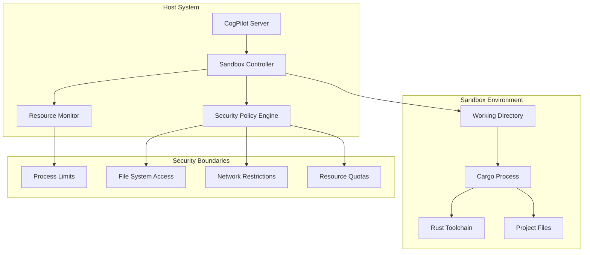
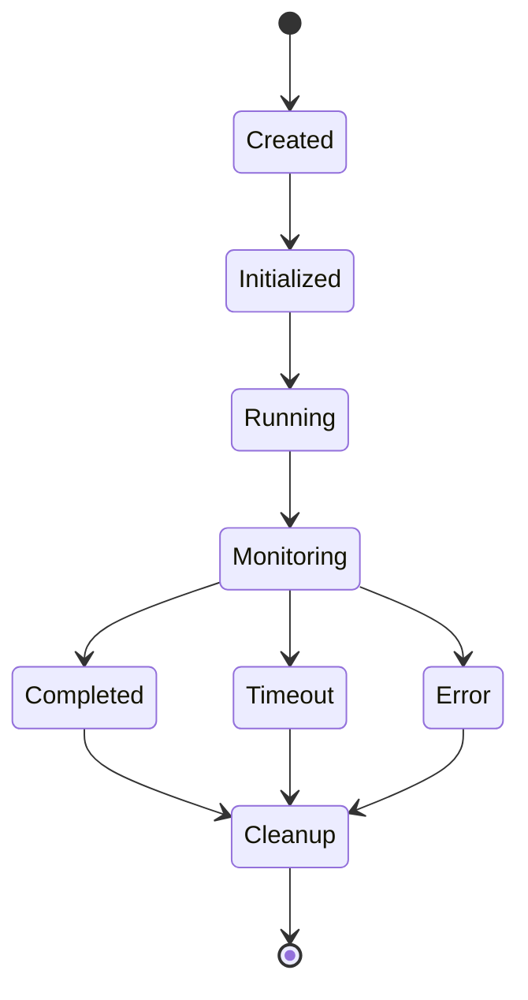

# Sandbox Design Specification

## Overview

This document specifies the sandbox design for CogPilot, ensuring secure execution of Rust Cargo commands through comprehensive process isolation, resource limiting, and security controls.

## Sandbox Architecture

### Process Isolation Model



### Sandbox Components

#### 1. Working Directory Isolation

**Implementation Strategy:**

- Each command execution creates a temporary isolated directory
- Directory permissions restricted to current user only
- Automatic cleanup on command completion or timeout

**Directory Structure:**

```
/tmp/cogpilot-sandbox-{uuid}/
├── workspace/          # Project files (read-only mount)
├── cargo-home/         # Cargo registry/cache (controlled)
├── target/            # Build output (size-limited)
├── logs/              # Execution logs
└── metadata/          # Command metadata
```

**Security Controls:**

```yaml
directory_permissions:
  workspace: "ro"        # Read-only
  cargo_home: "rw"       # Read-write (controlled)
  target: "rw"           # Read-write (size-limited)
  logs: "wo"             # Write-only
  metadata: "rw"         # Read-write (system only)

size_limits:
  total_workspace: "10GB"
  target_directory: "5GB"
  log_files: "100MB"
  temp_files: "1GB"
```

#### 2. Process Sandboxing

**Process Isolation:**

- Use OS-level process isolation (Windows: Job Objects, Linux: cgroups)
- Restrict system calls through security policies
- Prevent privilege escalation

**Resource Limits:**

```yaml
process_limits:
  cpu_time: "300s"           # 5 minutes max
  wall_time: "600s"          # 10 minutes max
  memory: "512MB"            # Maximum RAM (reduced for local use)
  processes: 25              # Max child processes (reduced)
  threads: 50                # Max threads (reduced)
  file_descriptors: 500      # Max open files (reduced)
```

**Windows Implementation:**

```powershell
# Job Object Configuration
$jobObject = New-Object System.Diagnostics.ProcessStartInfo
$jobObject.CreateNoWindow = $true
$jobObject.UseShellExecute = $false
$jobObject.RedirectStandardOutput = $true
$jobObject.RedirectStandardError = $true
$jobObject.WorkingDirectory = $sandboxPath
```

**Linux Implementation:**

```bash
# cgroups configuration
echo "2048M" > /sys/fs/cgroup/memory/cogpilot/memory.limit_in_bytes
echo "300" > /sys/fs/cgroup/cpu/cogpilot/cpu.cfs_period_us
echo "150" > /sys/fs/cgroup/cpu/cogpilot/cpu.cfs_quota_us
```

#### 3. Network Restrictions

**Network Policy:**

- Block all network access by default
- Allow only essential registry access (crates.io, GitHub)
- Implement allowlist-based access control

**Allowed Endpoints:**

```yaml
network_allowlist:
  - "crates.io"
  - "index.crates.io"
  - "github.com"
  - "api.github.com"
  - "raw.githubusercontent.com"

blocked_protocols:
  - "ftp"
  - "ssh"
  - "telnet"
  - "smtp"

port_restrictions:
  allowed_ports: [80, 443]
  blocked_ranges: ["1-1023", "8080-8090"]
```

#### 4. File System Access Control

**Access Restrictions:**

- Prevent access to sensitive system directories
- Block executable file creation outside target directory
- Monitor file system operations

**Blocked Directories:**

```yaml
blocked_paths:
  - "/etc"
  - "/usr/bin"
  - "/usr/sbin"
  - "/bin"
  - "/sbin"
  - "/root"
  - "/home/*/.*"
  - "C:/Windows"
  - "C:/Program Files"
  - "C:/Users/*/AppData"
```

**File Operation Monitoring:**

```rust
struct FileSystemMonitor {
    allowed_operations: Vec<FileOperation>,
    blocked_paths: Vec<PathBuf>,
    size_limits: HashMap<PathBuf, u64>,
}

impl FileSystemMonitor {
    fn validate_operation(&self, op: &FileOperation) -> Result<(), SandboxError> {
        // Validate file operations
        match op.operation_type {
            OperationType::Read => self.validate_read_access(&op.path),
            OperationType::Write => self.validate_write_access(&op.path, op.size),
            OperationType::Execute => self.validate_execute_access(&op.path),
        }
    }
}
```

## Security Policies

### Execution Policy

```yaml
execution_policy:
  allowed_executables:
    - "cargo"
    - "rustc"
    - "rustup"
    - "git"

  blocked_executables:
    - "sh"
    - "bash"
    - "powershell"
    - "cmd"
    - "python"
    - "node"

  command_validation:
    - regex: "^cargo\\s+(build|check|test|clean|doc)\\s"
      description: "Basic cargo commands"
    - regex: "^cargo\\s+--version$"
      description: "Version check"
```

### Security Validation

**Input Validation:**

```rust
struct CommandValidator {
    allowed_patterns: Vec<Regex>,
    blocked_patterns: Vec<Regex>,
    max_length: usize,
}

impl CommandValidator {
    fn validate_command(&self, cmd: &str) -> Result<(), ValidationError> {
        // Length check
        if cmd.len() > self.max_length {
            return Err(ValidationError::CommandTooLong);
        }

        // Blocked patterns
        for pattern in &self.blocked_patterns {
            if pattern.is_match(cmd) {
                return Err(ValidationError::BlockedPattern);
            }
        }

        // Allowed patterns
        let allowed = self.allowed_patterns.iter()
            .any(|pattern| pattern.is_match(cmd));

        if !allowed {
            return Err(ValidationError::UnauthorizedCommand);
        }

        Ok(())
    }
}
```

## Implementation Details

### Sandbox Lifecycle



### Resource Management

**Memory Management:**

```rust
struct ResourceManager {
    memory_limit: u64,
    cpu_limit: Duration,
    process_limit: u32,
    current_usage: ResourceUsage,
}

impl ResourceManager {
    fn monitor_resources(&mut self) -> Result<(), ResourceError> {
        let usage = self.get_current_usage()?;

        if usage.memory > self.memory_limit {
            return Err(ResourceError::MemoryLimitExceeded);
        }

        if usage.cpu_time > self.cpu_limit {
            return Err(ResourceError::CpuLimitExceeded);
        }

        if usage.process_count > self.process_limit {
            return Err(ResourceError::ProcessLimitExceeded);
        }

        self.current_usage = usage;
        Ok(())
    }
}
```

### Error Handling

**Sandbox Errors:**

```rust
#[derive(Debug, thiserror::Error)]
pub enum SandboxError {
    #[error("Resource limit exceeded: {resource}")]
    ResourceLimitExceeded { resource: String },

    #[error("Unauthorized file access: {path}")]
    UnauthorizedAccess { path: PathBuf },

    #[error("Command execution timeout")]
    ExecutionTimeout,

    #[error("Security policy violation: {violation}")]
    SecurityViolation { violation: String },

    #[error("Sandbox initialization failed: {reason}")]
    InitializationFailed { reason: String },
}
```

## Security Considerations

### Threat Mitigation

**Process Escape Prevention:**

- Disable debugging capabilities
- Prevent ptrace attachment
- Block privilege escalation syscalls

**Data Exfiltration Prevention:**

- Monitor network connections
- Restrict file system access
- Log all file operations

**Resource Exhaustion Protection:**

- CPU time limits
- Memory usage caps
- Process count restrictions
- File system quotas

### Monitoring and Logging

**Security Events:**

```yaml
monitored_events:
  - file_access_violations
  - network_connection_attempts
  - process_creation
  - resource_limit_approaches
  - security_policy_violations
  - command_execution_attempts

log_levels:
  - INFO: Normal operations
  - WARN: Policy violations
  - ERROR: Security incidents
  - CRITICAL: System compromise attempts
```

## Platform-Specific Implementation

### Windows Implementation

**Job Objects:**

```rust
use windows_sys::Win32::System::JobObjects::*;

struct WindowsSandbox {
    job_handle: HANDLE,
    process_handle: HANDLE,
}

impl WindowsSandbox {
    fn create_job_object(&self) -> Result<HANDLE, SandboxError> {
        let job = unsafe { CreateJobObjectW(null_mut(), null_mut()) };
        if job.is_null() {
            return Err(SandboxError::InitializationFailed {
                reason: "Failed to create job object".to_string(),
            });
        }

        // Set limits
        let mut limits = JOBOBJECT_EXTENDED_LIMIT_INFORMATION::default();
        limits.BasicLimitInformation.LimitFlags =
            JOB_OBJECT_LIMIT_KILL_ON_JOB_CLOSE |
            JOB_OBJECT_LIMIT_PROCESS_TIME |
            JOB_OBJECT_LIMIT_PROCESS_MEMORY;

        Ok(job)
    }
}
```

### Linux Implementation

**Namespaces and cgroups:**

```rust
use nix::unistd::{fork, ForkResult};
use nix::sched::{clone, CloneFlags};

struct LinuxSandbox {
    pid: nix::unistd::Pid,
    cgroup_path: PathBuf,
}

impl LinuxSandbox {
    fn create_namespace(&self) -> Result<(), SandboxError> {
        let flags = CloneFlags::CLONE_NEWUSER |
                   CloneFlags::CLONE_NEWPID |
                   CloneFlags::CLONE_NEWNS |
                   CloneFlags::CLONE_NEWNET;

        match unsafe { fork() } {
            Ok(ForkResult::Child) => {
                // Child process in new namespace
                self.setup_sandbox_environment()?;
                Ok(())
            }
            Ok(ForkResult::Parent { child }) => {
                self.pid = child;
                self.setup_cgroups()?;
                Ok(())
            }
            Err(e) => Err(SandboxError::InitializationFailed {
                reason: format!("Fork failed: {}", e),
            }),
        }
    }
}
```

## Testing and Validation

### Security Testing

**Test Categories:**

1. **Escape Testing**: Attempt to break out of sandbox
2. **Resource Testing**: Verify resource limits are enforced
3. **Access Testing**: Validate file system restrictions
4. **Network Testing**: Confirm network isolation

**Example Test Cases:**

```rust
#[cfg(test)]
mod tests {
    use super::*;

    #[test]
    fn test_file_access_restriction() {
        let sandbox = Sandbox::new();
        let result = sandbox.execute_command("cat /etc/passwd");
        assert!(matches!(result, Err(SandboxError::UnauthorizedAccess { .. })));
    }

    #[test]
    fn test_memory_limit_enforcement() {
        let sandbox = Sandbox::new();
        let result = sandbox.execute_command("cargo build --release");
        // Should succeed within memory limits
        assert!(result.is_ok());
    }

    #[test]
    fn test_network_isolation() {
        let sandbox = Sandbox::new();
        let result = sandbox.execute_command("curl example.com");
        assert!(matches!(result, Err(SandboxError::SecurityViolation { .. })));
    }
}
```

## Configuration

### Sandbox Configuration Schema

```yaml
sandbox_config:
  resource_limits:
    memory_mb: 2048
    cpu_seconds: 300
    wall_seconds: 600
    processes: 50
    threads: 100
    files: 1000

  file_system:
    workspace_size_mb: 10240
    target_size_mb: 5120
    log_size_mb: 100
    temp_size_mb: 1024

  network:
    enabled: true
    allowlist:
      - "crates.io"
      - "github.com"
    ports: [80, 443]

  security:
    strict_mode: true
    audit_logging: true
    block_shell_access: true
```

## Deployment Considerations

### Production Deployment

**Security Hardening:**

- Run with minimal privileges
- Use dedicated user account
- Enable comprehensive logging
- Regular security updates

**Monitoring Requirements:**

- Resource usage tracking
- Security event logging
- Performance metrics
- Error rate monitoring

**Maintenance:**

- Regular sandbox cleanup
- Log rotation
- Security policy updates
- Performance tuning

This sandbox design provides comprehensive security isolation while maintaining the functionality needed for Rust Cargo operations. The implementation ensures that malicious or poorly written code cannot escape the sandbox environment or compromise the host system.
