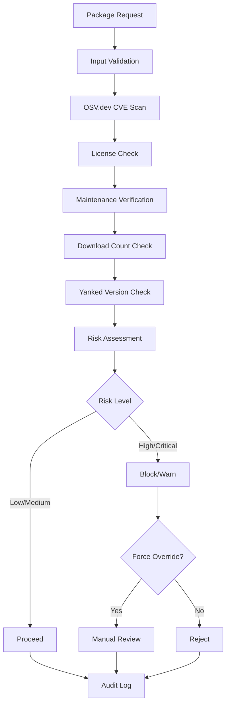

# Security Scanning Integration

## Table of Contents

- [Overview](#overview)
- [OSV.dev API Integration](#osvdev-api-integration)
- [CVE Severity Management](#cve-severity-management)
- [License Compatibility Checking](#license-compatibility-checking)
- [Maintenance Status Verification](#maintenance-status-verification)
- [Download Count Validation](#download-count-validation)
- [Yanked Version Detection](#yanked-version-detection)
- [Security Override Mechanisms](#security-override-mechanisms)
- [Caching and Performance](#caching-and-performance)
- [Error Handling and Fallback](#error-handling-and-fallback)

## Overview

CogPilot integrates comprehensive security scanning capabilities to ensure all dependencies are thoroughly vetted before installation. The system combines multiple security data sources to provide a complete security assessment.

### Security Assessment Pipeline



## OSV.dev API Integration

### API Configuration

```toml
[security.osv]
api_url = "https://api.osv.dev/v1"
timeout = 30
retry_attempts = 3
retry_delay = 1000  # milliseconds
cache_ttl = 3600   # seconds
```

### Query Structure

#### Single Package Query

```json
{
  "package": {
    "name": "serde",
    "ecosystem": "crates.io"
  },
  "version": "1.0.0"
}
```

#### Batch Query

```json
{
  "queries": [
    {
      "package": {
        "name": "serde",
        "ecosystem": "crates.io"
      },
      "version": "1.0.0"
    },
    {
      "package": {
        "name": "tokio",
        "ecosystem": "crates.io"
      },
      "version": "1.20.0"
    }
  ]
}
```

### Response Processing

#### Vulnerability Data Structure

```rust
#[derive(Debug, Clone, Serialize, Deserialize)]
pub struct OsvVulnerability {
    pub id: String,
    pub summary: String,
    pub details: Option<String>,
    pub severity: Option<Vec<OsvSeverity>>,
    pub affected: Vec<OsvAffected>,
    pub references: Vec<OsvReference>,
    pub database_specific: Option<serde_json::Value>,
    pub ecosystem_specific: Option<serde_json::Value>,
}

#[derive(Debug, Clone, Serialize, Deserialize)]
pub struct OsvSeverity {
    pub type_: String,
    pub score: String,
}

#[derive(Debug, Clone, Serialize, Deserialize)]
pub struct OsvAffected {
    pub package: OsvPackage,
    pub ranges: Vec<OsvRange>,
    pub versions: Vec<String>,
    pub ecosystem_specific: Option<serde_json::Value>,
}

#[derive(Debug, Clone, Serialize, Deserialize)]
pub struct OsvRange {
    pub type_: String,
    pub events: Vec<OsvEvent>,
}

#[derive(Debug, Clone, Serialize, Deserialize)]
pub struct OsvEvent {
    pub introduced: Option<String>,
    pub fixed: Option<String>,
    pub last_affected: Option<String>,
}
```

### Implementation

```rust
use reqwest::Client;
use serde::{Deserialize, Serialize};
use std::time::Duration;
use tokio::time::timeout;

pub struct OsvClient {
    client: Client,
    base_url: String,
    timeout: Duration,
}

impl OsvClient {
    pub fn new(base_url: String, timeout_seconds: u64) -> Self {
        let client = Client::builder()
            .timeout(Duration::from_secs(timeout_seconds))
            .user_agent("CogPilot/1.0.0")
            .build()
            .expect("Failed to create HTTP client");

        Self {
            client,
            base_url,
            timeout: Duration::from_secs(timeout_seconds),
        }
    }

    pub async fn query_vulnerabilities(
        &self,
        package: &str,
        version: Option<&str>,
    ) -> Result<Vec<OsvVulnerability>, OsvError> {
        let query = OsvQuery {
            package: OsvPackage {
                name: package.to_string(),
                ecosystem: "crates.io".to_string(),
            },
            version: version.map(|v| v.to_string()),
        };

        let url = format!("{}/query", self.base_url);

        let response = timeout(
            self.timeout,
            self.client.post(&url).json(&query).send()
        ).await
        .map_err(|_| OsvError::Timeout)?
        .map_err(|e| OsvError::HttpError(e))?;

        if !response.status().is_success() {
            return Err(OsvError::ApiError(response.status().as_u16()));
        }

        let osv_response: OsvResponse = response.json().await
            .map_err(|e| OsvError::ParseError(e.to_string()))?;

        Ok(osv_response.vulns)
    }

    pub async fn batch_query_vulnerabilities(
        &self,
        queries: Vec<(String, Option<String>)>,
    ) -> Result<Vec<Vec<OsvVulnerability>>, OsvError> {
        let batch_query = OsvBatchQuery {
            queries: queries.into_iter().map(|(name, version)| OsvQuery {
                package: OsvPackage {
                    name,
                    ecosystem: "crates.io".to_string(),
                },
                version,
            }).collect(),
        };

        let url = format!("{}/querybatch", self.base_url);

        let response = timeout(
            self.timeout,
            self.client.post(&url).json(&batch_query).send()
        ).await
        .map_err(|_| OsvError::Timeout)?
        .map_err(|e| OsvError::HttpError(e))?;

        if !response.status().is_success() {
            return Err(OsvError::ApiError(response.status().as_u16()));
        }

        let batch_response: OsvBatchResponse = response.json().await
            .map_err(|e| OsvError::ParseError(e.to_string()))?;

        Ok(batch_response.results.into_iter().map(|r| r.vulns).collect())
    }
}
```

## CVE Severity Management

### Severity Classification

#### CVSS Score Mapping

```rust
#[derive(Debug, Clone, Copy, PartialEq, Eq, PartialOrd, Ord)]
pub enum SeverityLevel {
    None = 0,
    Low = 1,
    Medium = 2,
    High = 3,
    Critical = 4,
}

impl SeverityLevel {
    pub fn from_cvss_score(score: f32) -> Self {
        match score {
            0.0 => SeverityLevel::None,
            0.1..=3.9 => SeverityLevel::Low,
            4.0..=6.9 => SeverityLevel::Medium,
            7.0..=8.9 => SeverityLevel::High,
            9.0..=10.0 => SeverityLevel::Critical,
            _ => SeverityLevel::Unknown, // Explicitly flag invalid scores
        }
    }

    pub fn from_string(severity: &str) -> Self {
        match severity.to_lowercase().as_str() {
            "none" => SeverityLevel::None,
            "low" => SeverityLevel::Low,
            "medium" | "moderate" => SeverityLevel::Medium,
            "high" => SeverityLevel::High,
            "critical" => SeverityLevel::Critical,
            _ => SeverityLevel::Medium, // Default for unknown
        }
    }
}
```

### Severity Threshold Configuration

```toml
[security.severity_thresholds]
block_critical = true
block_high = true
warn_medium = true
log_low = true
log_none = false

[security.severity_actions]
critical = "block"
high = "block"
medium = "warn"
low = "log"
none = "ignore"
```

### Risk Assessment Algorithm

```rust
pub struct RiskAssessment {
    pub package: String,
    pub version: Option<String>,
    pub vulnerabilities: Vec<ProcessedVulnerability>,
    pub overall_severity: SeverityLevel,
    pub risk_score: u32,
    pub recommendation: SecurityRecommendation,
}

#[derive(Debug, Clone)]
pub struct ProcessedVulnerability {
    pub id: String,
    pub severity: SeverityLevel,
    pub cvss_score: Option<f32>,
    pub description: String,
    pub affects_version: bool,
    pub has_fix: bool,
    pub fix_version: Option<String>,
}

impl RiskAssessment {
    pub fn calculate_risk(&mut self) {
        let mut risk_score = 0;
        let mut max_severity = SeverityLevel::None;

        for vuln in &self.vulnerabilities {
            if !vuln.affects_version {
                continue;
            }

            // Add score based on severity
            risk_score += match vuln.severity {
                SeverityLevel::Critical => 10,
                SeverityLevel::High => 7,
                SeverityLevel::Medium => 4,
                SeverityLevel::Low => 1,
                SeverityLevel::None => 0,
            };

            // Track highest severity
            if vuln.severity > max_severity {
                max_severity = vuln.severity;
            }

            // Reduce score if fix is available
            if vuln.has_fix {
                risk_score = (risk_score as f32 * 0.7) as u32;
            }
        }

        self.risk_score = risk_score;
        self.overall_severity = max_severity;
        self.recommendation = self.determine_recommendation();
    }

    fn determine_recommendation(&self) -> SecurityRecommendation {
        match self.overall_severity {
            SeverityLevel::Critical => SecurityRecommendation::Block,
            SeverityLevel::High => SecurityRecommendation::Block,
            SeverityLevel::Medium => SecurityRecommendation::Warn,
            SeverityLevel::Low => SecurityRecommendation::Log,
            SeverityLevel::None => SecurityRecommendation::Proceed,
        }
    }
}
```

## License Compatibility Checking

### Supported Licenses

```rust
#[derive(Debug, Clone, PartialEq)]
pub enum LicenseCompatibility {
    Compatible,
    Incompatible,
    RequiresReview,
    Unknown,
}

pub struct LicenseChecker {
    compatible_licenses: Vec<String>,
    incompatible_licenses: Vec<String>,
    review_required_licenses: Vec<String>,
}

impl LicenseChecker {
    pub fn new() -> Self {
        Self {
            compatible_licenses: vec![
                "MIT".to_string(),
                "Apache-2.0".to_string(),
                "BSD-2-Clause".to_string(),
                "BSD-3-Clause".to_string(),
                "ISC".to_string(),
                "Unlicense".to_string(),
                "CC0-1.0".to_string(),
                "MIT OR Apache-2.0".to_string(),
                "Apache-2.0 OR MIT".to_string(),
                "Apache-2.0 WITH LLVM-exception".to_string(),
            ],
            incompatible_licenses: vec![
                "GPL-2.0".to_string(),
                "GPL-3.0".to_string(),
                "AGPL-3.0".to_string(),
                "LGPL-2.1".to_string(),
                "LGPL-3.0".to_string(),
                "SSPL-1.0".to_string(),
                "Commons Clause".to_string(),
            ],
            review_required_licenses: vec![
                "MPL-2.0".to_string(),
                "EPL-2.0".to_string(),
                "CDDL-1.0".to_string(),
                "OSL-3.0".to_string(),
            ],
        }
    }

    pub fn check_license(&self, license: &str) -> LicenseCompatibility {
        let normalized = self.normalize_license(license);

        if self.compatible_licenses.contains(&normalized) {
            LicenseCompatibility::Compatible
        } else if self.incompatible_licenses.contains(&normalized) {
            LicenseCompatibility::Incompatible
        } else if self.review_required_licenses.contains(&normalized) {
            LicenseCompatibility::RequiresReview
        } else {
            LicenseCompatibility::Unknown
        }
    }

    fn normalize_license(&self, license: &str) -> String {
        license.trim()
            .replace(" ", "")
            .replace("_", "-")
            .to_uppercase()
    }
}
```

### License Policy Configuration

```toml
[security.license_policy]
allow_compatible = true
allow_unknown = false
require_review_for_unknown = true
block_incompatible = true

[security.license_policy.overrides]
# Allow specific packages with incompatible licenses
allowed_packages = [
    "readline",  # GPL but commonly used
]

# Block specific packages regardless of license
blocked_packages = [
    "proprietary-package",
]
```

## Maintenance Status Verification

### Maintenance Metrics

```rust
#[derive(Debug, Clone)]
pub struct MaintenanceStatus {
    pub package: String,
    pub last_updated: chrono::DateTime<chrono::Utc>,
    pub days_since_update: u32,
    pub commit_frequency: CommitFrequency,
    pub issue_response_time: Option<Duration>,
    pub active_maintainers: u32,
    pub is_maintained: bool,
}

#[derive(Debug, Clone)]
pub enum CommitFrequency {
    Daily,
    Weekly,
    Monthly,
    Quarterly,
    Yearly,
    Stale,
}

impl MaintenanceStatus {
    pub fn assess_maintenance(&mut self) {
        // Consider package stale if not updated in 365 days
        if self.days_since_update > 365 {
            self.is_maintained = false;
            return;
        }

        // Assess based on multiple factors
        let mut maintenance_score = 0;

        // Update frequency scoring
        maintenance_score += match self.commit_frequency {
            CommitFrequency::Daily => 5,
            CommitFrequency::Weekly => 4,
            CommitFrequency::Monthly => 3,
            CommitFrequency::Quarterly => 2,
            CommitFrequency::Yearly => 1,
            CommitFrequency::Stale => 0,
        };

        // Active maintainers scoring
        maintenance_score += match self.active_maintainers {
            0 => 0,
            1 => 1,
            2..=5 => 2,
            _ => 3,
        };

        // Issue response time scoring
        if let Some(response_time) = self.issue_response_time {
            maintenance_score += match response_time.as_secs() {
                0..=86400 => 3,        // 1 day
                86401..=604800 => 2,   // 1 week
                604801..=2592000 => 1, // 1 month
                _ => 0,
            };
        }

        // Determine maintenance status
        self.is_maintained = maintenance_score >= 5;
    }
}
```

### Maintenance Data Sources

```rust
pub struct MaintenanceChecker {
    github_client: GitHubClient,
    crates_io_client: CratesIoClient,
    cache: Cache<MaintenanceStatus>,
}

impl MaintenanceChecker {
    pub async fn check_maintenance(&self, package: &str) -> Result<MaintenanceStatus, MaintenanceError> {
        // Check cache first
        if let Some(cached) = self.cache.get(package).await {
            return Ok(cached);
        }

        // Get package metadata from crates.io
        let crates_info = self.crates_io_client.get_package_info(package).await?;

        // Get repository information
        let repo_info = if let Some(repo_url) = crates_info.repository {
            self.github_client.get_repository_info(&repo_url).await?
        } else {
            return Err(MaintenanceError::NoRepository);
        };

        // Calculate maintenance status
        let mut status = MaintenanceStatus {
            package: package.to_string(),
            last_updated: crates_info.updated_at,
            days_since_update: (chrono::Utc::now() - crates_info.updated_at).num_days() as u32,
            commit_frequency: self.calculate_commit_frequency(&repo_info.commits),
            issue_response_time: repo_info.average_issue_response_time,
            active_maintainers: repo_info.active_contributors,
            is_maintained: false,
        };

        status.assess_maintenance();

        // Cache result
        self.cache.set(package.to_string(), status.clone(), None).await?;

        Ok(status)
    }

    fn calculate_commit_frequency(&self, commits: &[GitHubCommit]) -> CommitFrequency {
        if commits.is_empty() {
            return CommitFrequency::Stale;
        }

        let now = chrono::Utc::now();
        let mut recent_commits = 0;

        for commit in commits {
            let days_ago = (now - commit.date).num_days();
            if days_ago <= 30 {
                recent_commits += 1;
            }
        }

        match recent_commits {
            0 => CommitFrequency::Stale,
            1..=3 => CommitFrequency::Monthly,
            4..=12 => CommitFrequency::Weekly,
            _ => CommitFrequency::Daily,
        }
    }
}
```

## Download Count Validation

### Download Metrics

```rust
#[derive(Debug, Clone)]
pub struct DownloadMetrics {
    pub package: String,
    pub total_downloads: u64,
    pub recent_downloads: u64,
    pub daily_average: f64,
    pub download_trend: DownloadTrend,
    pub popularity_score: u32,
}

#[derive(Debug, Clone)]
pub enum DownloadTrend {
    Increasing,
    Stable,
    Decreasing,
    Unknown,
}

impl DownloadMetrics {
    pub fn assess_popularity(&mut self) {
        let mut score = 0;

        // Total downloads scoring
        score += match self.total_downloads {
            0..=100 => 0,
            101..=1000 => 1,
            1001..=10000 => 2,
            10001..=100000 => 3,
            100001..=1000000 => 4,
            _ => 5,
        };

        // Recent downloads scoring
        score += match self.recent_downloads {
            0..=10 => 0,
            11..=100 => 1,
            101..=1000 => 2,
            1001..=10000 => 3,
            _ => 4,
        };

        // Trend scoring
        score += match self.download_trend {
            DownloadTrend::Increasing => 2,
            DownloadTrend::Stable => 1,
            DownloadTrend::Decreasing => 0,
            DownloadTrend::Unknown => 0,
        };

        self.popularity_score = score;
    }

    pub fn meets_threshold(&self, min_downloads: u64) -> bool {
        self.total_downloads >= min_downloads
    }
}
```

### Download Validation Configuration

```toml
[security.download_validation]
min_total_downloads = 1000
min_recent_downloads = 10
min_daily_average = 1.0
consider_trend = true
whitelist_low_download_packages = [
    "experimental-package",
    "internal-tool",
]
```

## Yanked Version Detection

### Yanked Version Handling

```rust
#[derive(Debug, Clone)]
pub struct YankedVersionChecker {
    crates_io_client: CratesIoClient,
    cache: Cache<YankedInfo>,
}

#[derive(Debug, Clone)]
pub struct YankedInfo {
    pub package: String,
    pub version: String,
    pub is_yanked: bool,
    pub yank_reason: Option<String>,
    pub yank_date: Option<chrono::DateTime<chrono::Utc>>,
    pub alternative_versions: Vec<String>,
}

impl YankedVersionChecker {
    pub async fn check_yanked(&self, package: &str, version: &str) -> Result<YankedInfo, YankedError> {
        let cache_key = format!("{}:{}", package, version);

        // Check cache first
        if let Some(cached) = self.cache.get(&cache_key).await {
            return Ok(cached);
        }

        // Query crates.io API
        let version_info = self.crates_io_client.get_version_info(package, version).await?;

        let yanked_info = YankedInfo {
            package: package.to_string(),
            version: version.to_string(),
            is_yanked: version_info.yanked,
            yank_reason: version_info.yank_reason,
            yank_date: version_info.yank_date,
            alternative_versions: self.get_alternative_versions(package, version).await?,
        };

        // Cache result
        self.cache.set(cache_key, yanked_info.clone(), None).await?;

        Ok(yanked_info)
    }

    async fn get_alternative_versions(&self, package: &str, yanked_version: &str) -> Result<Vec<String>, YankedError> {
        let package_info = self.crates_io_client.get_package_info(package).await?;

        Ok(package_info.versions.into_iter()
            .filter(|v| !v.yanked && v.num != yanked_version)
            .map(|v| v.num)
            .collect())
    }
}
```

### Yanked Version Policy

```toml
[security.yanked_policy]
block_yanked_versions = true
suggest_alternatives = true
allow_yanked_with_override = false
warn_on_yanked_dependencies = true
```

## Security Override Mechanisms

### Override Types

```rust
#[derive(Debug, Clone)]
pub enum SecurityOverride {
    ForceInsecure {
        justification: String,
        approved_by: String,
        expiry_date: Option<chrono::DateTime<chrono::Utc>>,
    },
    TemporaryAllow {
        duration: chrono::Duration,
        reason: String,
    },
    PermanentWhitelist {
        approval_id: String,
        approved_by: String,
        conditions: Vec<String>,
    },
}

#[derive(Debug, Clone)]
pub struct OverrideRequest {
    pub package: String,
    pub version: Option<String>,
    pub override_type: SecurityOverride,
    pub security_issues: Vec<String>,
    pub requested_by: String,
    pub request_date: chrono::DateTime<chrono::Utc>,
}
```

### Override Validation

```rust
pub struct OverrideValidator {
    authorized_users: Vec<String>,
    max_override_duration: chrono::Duration,
    require_approval: bool,
}

impl OverrideValidator {
    pub fn validate_override(&self, request: &OverrideRequest) -> Result<(), OverrideError> {
        // Check authorization
        if !self.authorized_users.contains(&request.requested_by) {
            return Err(OverrideError::Unauthorized);
        }

        // Validate override type
        match &request.override_type {
            SecurityOverride::ForceInsecure { justification, .. } => {
                if justification.len() < 50 {
                    return Err(OverrideError::InsufficientJustification);
                }
            }
            SecurityOverride::TemporaryAllow { duration, .. } => {
                if *duration > self.max_override_duration {
                    return Err(OverrideError::DurationTooLong);
                }
            }
            SecurityOverride::PermanentWhitelist { approval_id, .. } => {
                if !self.verify_approval_id(approval_id) {
                    return Err(OverrideError::InvalidApprovalId);
                }
            }
        }

        Ok(())
    }

    fn verify_approval_id(&self, approval_id: &str) -> bool {
        // Implement approval ID verification logic
        approval_id.starts_with("APPROVED-") && approval_id.len() == 20
    }
}
```

### Override Audit Trail

```rust
#[derive(Debug, Clone)]
pub struct OverrideAuditEntry {
    pub id: String,
    pub package: String,
    pub version: Option<String>,
    pub override_type: SecurityOverride,
    pub security_issues: Vec<String>,
    pub requested_by: String,
    pub approved_by: Option<String>,
    pub request_date: chrono::DateTime<chrono::Utc>,
    pub approval_date: Option<chrono::DateTime<chrono::Utc>>,
    pub used_date: Option<chrono::DateTime<chrono::Utc>>,
    pub status: OverrideStatus,
}

#[derive(Debug, Clone)]
pub enum OverrideStatus {
    Pending,
    Approved,
    Rejected,
    Used,
    Expired,
}
```

## Caching and Performance

### Cache Configuration

```toml
[security.cache]
vulnerability_cache_ttl = 3600  # 1 hour
license_cache_ttl = 86400      # 24 hours
maintenance_cache_ttl = 43200  # 12 hours
download_cache_ttl = 3600      # 1 hour
yanked_cache_ttl = 1800        # 30 minutes
max_cache_size = 10000
cleanup_interval = 300         # 5 minutes
```

### Performance Optimization

```rust
pub struct SecurityScanner {
    osv_client: OsvClient,
    license_checker: LicenseChecker,
    maintenance_checker: MaintenanceChecker,
    download_validator: DownloadValidator,
    yanked_checker: YankedVersionChecker,
    cache: SecurityCache,
}

impl SecurityScanner {
    pub async fn scan_package(&self, package: &str, version: Option<&str>) -> Result<SecurityScanResult, ScanError> {
        // Check cache first
        let cache_key = format!("{}:{}", package, version.unwrap_or("latest"));
        if let Some(cached) = self.cache.get(&cache_key).await {
            return Ok(cached);
        }

        // Perform parallel scans
        let (osv_result, license_result, maintenance_result, download_result, yanked_result) =
            tokio::try_join!(
                self.osv_client.query_vulnerabilities(package, version),
                self.license_checker.check_package_license(package),
                self.maintenance_checker.check_maintenance(package),
                self.download_validator.get_download_metrics(package),
                self.yanked_checker.check_yanked(package, version.unwrap_or("latest"))
            )?;

        // Combine results
        let scan_result = SecurityScanResult {
            package: package.to_string(),
            version: version.map(|v| v.to_string()),
            vulnerabilities: osv_result,
            license_compatibility: license_result,
            maintenance_status: maintenance_result,
            download_metrics: download_result,
            yanked_info: yanked_result,
            overall_risk: self.calculate_overall_risk(&osv_result, &license_result, &maintenance_result),
            scan_timestamp: chrono::Utc::now(),
        };

        // Cache result
        self.cache.set(cache_key, scan_result.clone(), None).await?;

        Ok(scan_result)
    }

    fn calculate_overall_risk(
        &self,
        vulnerabilities: &[ProcessedVulnerability],
        license: &LicenseCompatibility,
        maintenance: &MaintenanceStatus,
    ) -> RiskLevel {
        let mut risk_score = 0;

        // Vulnerability risk
        for vuln in vulnerabilities {
            risk_score += match vuln.severity {
                SeverityLevel::Critical => 10,
                SeverityLevel::High => 7,
                SeverityLevel::Medium => 4,
                SeverityLevel::Low => 1,
                SeverityLevel::None => 0,
            };
        }

        // License risk
        risk_score += match license {
            LicenseCompatibility::Incompatible => 5,
            LicenseCompatibility::RequiresReview => 3,
            LicenseCompatibility::Unknown => 2,
            LicenseCompatibility::Compatible => 0,
        };

        // Maintenance risk
        if !maintenance.is_maintained {
            risk_score += 3;
        }

        // Convert to risk level
        match risk_score {
            0..=2 => RiskLevel::Low,
            3..=7 => RiskLevel::Medium,
            8..=15 => RiskLevel::High,
            _ => RiskLevel::Critical,
        }
    }
}
```

## Error Handling and Fallback

### Error Types

```rust
#[derive(Debug, Clone)]
pub enum SecurityScanError {
    OsvApiError(String),
    LicenseCheckError(String),
    MaintenanceCheckError(String),
    DownloadValidationError(String),
    YankedCheckError(String),
    CacheError(String),
    NetworkError(String),
    RateLimitExceeded,
    ServiceUnavailable,
    InvalidResponse(String),
}
```

### Fallback Strategies

```rust
pub struct FallbackConfig {
    pub osv_fallback_enabled: bool,
    pub osv_fallback_url: Option<String>,
    pub license_fallback_enabled: bool,
    pub maintenance_fallback_enabled: bool,
    pub allow_scan_failure: bool,
    pub max_scan_failures: u32,
}

impl SecurityScanner {
    pub async fn scan_package_with_fallback(&self, package: &str, version: Option<&str>) -> Result<SecurityScanResult, ScanError> {
        // Try primary scan
        match self.scan_package(package, version).await {
            Ok(result) => Ok(result),
            Err(e) => {
                tracing::warn!("Primary security scan failed: {}", e);

                // Try fallback strategies
                if self.config.allow_scan_failure {
                    self.create_fallback_result(package, version, e).await
                } else {
                    Err(e)
                }
            }
        }
    }

    async fn create_fallback_result(&self, package: &str, version: Option<&str>, error: ScanError) -> Result<SecurityScanResult, ScanError> {
        // Create a conservative fallback result
        let fallback_result = SecurityScanResult {
            package: package.to_string(),
            version: version.map(|v| v.to_string()),
            vulnerabilities: vec![], // Empty - conservative approach
            license_compatibility: LicenseCompatibility::Unknown,
            maintenance_status: MaintenanceStatus::unknown(),
            download_metrics: DownloadMetrics::unknown(),
            yanked_info: YankedInfo::unknown(),
            overall_risk: RiskLevel::High, // Conservative - assume high risk
            scan_timestamp: chrono::Utc::now(),
        };

        // Log fallback usage
        tracing::warn!("Using fallback security scan result for {}:{:?} due to error: {}",
                      package, version, error);

        Ok(fallback_result)
    }
}
```

This security scanning integration provides comprehensive protection through multiple security data sources, intelligent caching, and robust error handling with fallback mechanisms.
